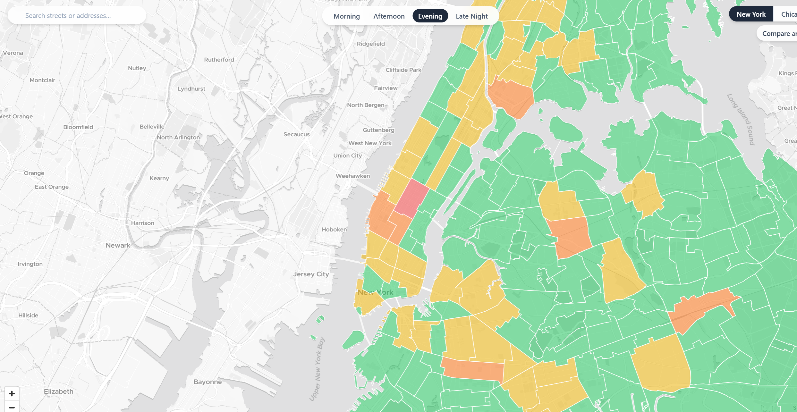
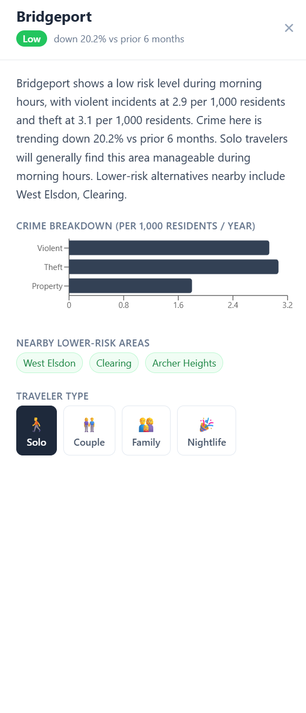
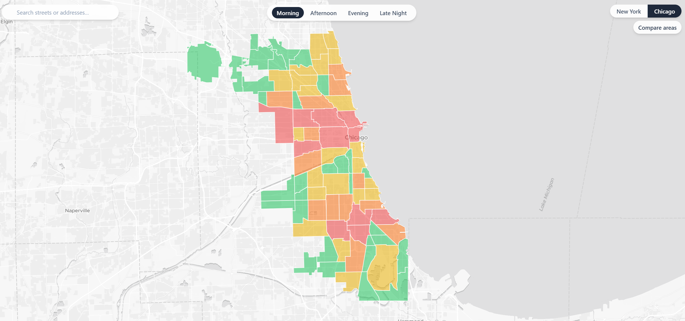

# SafeStep

Neighborhood safety intelligence for **New York City** and **Chicago**. Click any neighborhood on the map to get a real-time risk assessment, AI-generated briefing, and safer nearby alternatives — powered by 1.3M+ crime incidents from open government data.



| | |
|---|---|
|  |  |

## Features

- **Multi-city support** — Switch between New York City (262 neighborhoods) and Chicago (77 community areas)
- **Interactive choropleth map** — Neighborhoods colored by risk band: Low / Moderate / Elevated / High
- **Street search** — Search any address or street and fly the map directly there
- **Time-of-day filter** — Morning, Afternoon, Evening, Late Night each produce different risk scores
- **Traveler profiles** — Solo, Couple, Family, Nightlife — AI briefings adapt to who's asking
- **AI safety briefings** — Gemini 1.5 Flash generates a plain-English neighborhood summary from crime stats, news, and community signals
- **Compare mode** — Side-by-side risk comparison of two neighborhoods at a chosen time
- **Live news alerts** — 72-hour alert banner sourced from NewsAPI + NYT
- **Community sentiment** — Reddit signal classification for safety-relevant local posts
- **Nearby safer alternatives** — Suggests lower-risk neighborhoods in the same area

## Tech Stack

**Frontend**
- React 18 + TypeScript + Vite
- MapLibre GL JS + MapTiler (interactive map + geocoding)
- Tailwind CSS + Recharts

**Backend**
- Python 3.9 + FastAPI + asyncpg
- SQLAlchemy (async) + GeoAlchemy2
- PostgreSQL 16 + PostGIS 3.4
- APScheduler (cron jobs for data refresh)

**AI / Data**
- Google Gemini 1.5 Flash (safety briefings + Reddit classification)
- NYC Open Data / Socrata — 887k+ NYPD crime incidents
- Chicago Data Portal / Socrata — 475k+ CPD crime incidents
- NewsAPI + NYT Article Search API
- Reddit PRAW + Census ACS

## Local Development

### Prerequisites
- Python 3.9+
- Node.js 18+
- Docker Desktop

### 1. Clone and install

```bash
git clone https://github.com/AbhinavChaulagai/safestep.git
cd safestep
```

**Backend:**
```bash
cd backend
python -m venv .venv
.venv\Scripts\activate        # Windows
# source .venv/bin/activate   # Mac/Linux
pip install -r requirements.txt
```

**Frontend:**
```bash
cd frontend
npm install
```

### 2. Start the database

```bash
docker compose up -d
```

### 3. Configure environment variables

```bash
cp backend/.env.example backend/.env    # then fill in your keys
cp frontend/.env.example frontend/.env  # then fill in VITE_MAPTILER_KEY
```

### 4. Load data

```bash
cd backend

# NYC (262 neighborhoods, ~887k crime records, ~4 min)
.venv\Scripts\python ingestion/load_nyc_neighborhoods.py
.venv\Scripts\python ingestion/nyc_crime.py

# Chicago (77 community areas, ~475k crime records, ~2 min)
.venv\Scripts\python ingestion/load_chicago_neighborhoods.py
.venv\Scripts\python ingestion/chicago_crime.py

# Compute risk scores for all neighborhoods
.venv\Scripts\python -c "
import asyncio, sys; sys.path.insert(0,'.')
from database import AsyncSessionLocal, init_db
from services.scoring import recompute_all_scores
async def main():
    await init_db()
    async with AsyncSessionLocal() as db:
        n = await recompute_all_scores(db)
    print(f'{n} score rows written')
asyncio.run(main())
"
```

### 5. Run

```bash
# Terminal 1 — backend
cd backend && .venv\Scripts\python -m uvicorn main:app --reload --port 8000

# Terminal 2 — frontend
cd frontend && npm run dev
```

Open [http://localhost:5173](http://localhost:5173)

## API Keys

All keys are free. The app runs without them — Gemini falls back to rule-based briefings, news/Reddit sections show empty.

| Key | Where to get it |
|---|---|
| `VITE_MAPTILER_KEY` | [cloud.maptiler.com](https://cloud.maptiler.com) |
| `GEMINI_API_KEY` | [aistudio.google.com](https://aistudio.google.com) |
| `REDDIT_CLIENT_ID` + `SECRET` | [reddit.com/prefs/apps](https://reddit.com/prefs/apps) |
| `NYT_API_KEY` | [developer.nytimes.com](https://developer.nytimes.com) |
| `NEWS_API_KEY` | [newsapi.org](https://newsapi.org) |
| `CENSUS_API_KEY` | [api.census.gov/data/key_signup.html](https://api.census.gov/data/key_signup.html) |
| `SOCRATA_APP_TOKEN` | [data.cityofnewyork.us](https://data.cityofnewyork.us) |

## API Endpoints

```
GET /api/neighborhoods/{city}/geojson?time_bucket=evening
GET /api/safety/{city}/{neighborhood}?time_bucket=evening&traveler_type=solo
GET /api/safety/compare?city=nyc&areas=Harlem,Astoria&time_bucket=morning
GET /api/alerts/{city}
```

## Scoring Model

Each neighborhood gets a composite score per time bucket:

```
composite = (violent × 3.0) + (theft × 1.5) + (property × 1.0)
normalized = composite / 95th_percentile × 100
```

| Score | Band |
|---|---|
| 0–25 | Low |
| 26–50 | Moderate |
| 51–75 | Elevated |
| 76–100 | High |

Scores are normalized across all cities together so risk bands are comparable between NYC and Chicago.

## Data Sources

| Source | Coverage | Records |
|---|---|---|
| NYPD Historic Crime Data (`qgea-i56i`) | NYC, 2 years | 887k+ |
| NYC Neighborhood Tabulation Areas (`9nt8-h7nd`) | NYC | 262 boundaries |
| Chicago Police Dept Crimes (`ijzp-q8t2`) | Chicago, 2 years | 475k+ |
| Chicago Community Areas (`igwz-8jzy`) | Chicago | 77 boundaries |
| NewsAPI + NYT Article Search | Both cities | Live, 72h window |
| Reddit PRAW | r/nyc, r/chicago | Live, 30d window |
| Census ACS | Both cities | Population estimates |

## License

MIT
